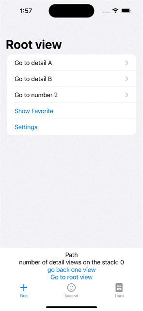

# NavigationStackSwiftUI

This project showcases the functionality of Swift's new Navigation Stack paradigm.

## Overview

• Dynamic Navigation Stack: The project implements a dynamic navigation system, allowing for the flexible management of views in the navigation hierarchy.
• Customized Tab Views: Features three main tab views (FirstTabView, SecondTabView, and ThirdTabView), each with unique navigation behaviors and designs.
• Navigation State Management: The NavigationStateManager class provides functionalities to manage and save the navigation state. This includes encoding and decoding of the selection path, which can be saved to user defaults or other storage mechanisms.
• Responsive UI Elements: Demonstrates the use of SwiftUI elements such as NavigationStack, NavigationLink, and Button for creating interactive navigation experiences.
• Data Handling: The app manages model data using the ModelDataManager class and utilizes Swift's native Codable protocol for encoding and decoding navigation states.
• Design Patterns: The project applies the MVVM pattern, making use of ObservableObject, @State, and other SwiftUI paradigms to manage and reflect state changes in the UI.

## Requirements

- SwiftUI
- iOS 16.0+

## Installation & Usage

1. Clone the repository.
2. Open `NavigationStackSwiftUI.xcodeproj` in Xcode.
3. Run the project in a simulator or a real device.

Demo GIF:

